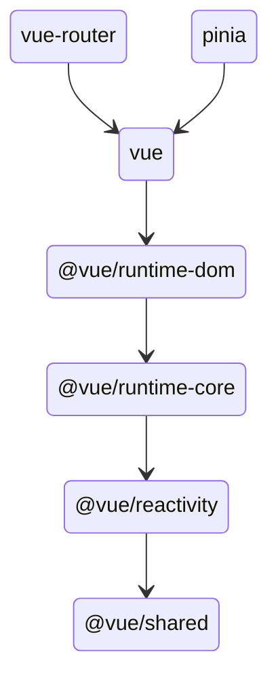
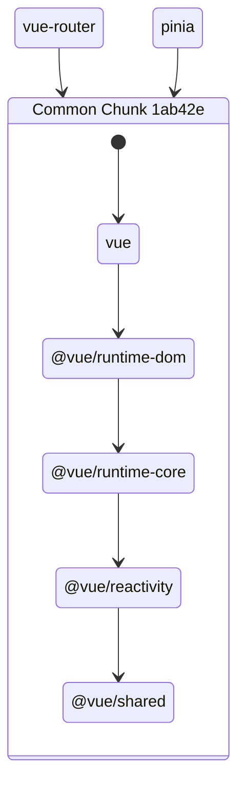
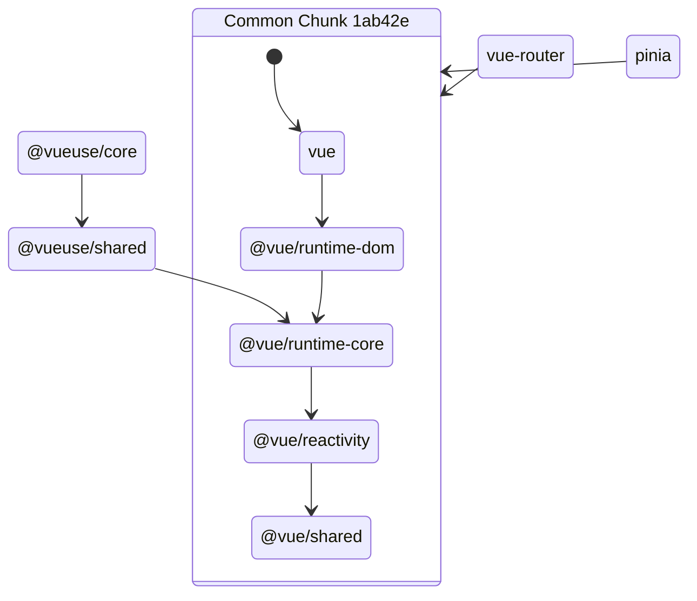
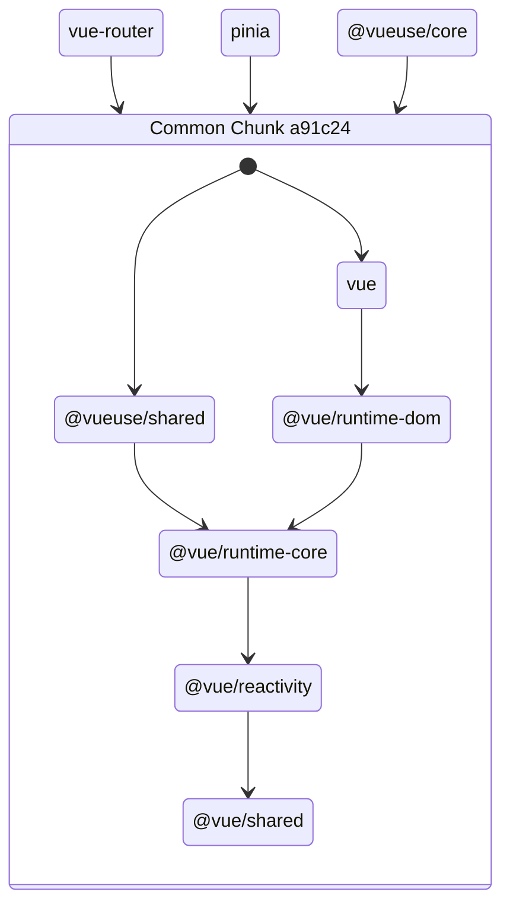

# vite-plugin-optimize-exclude

[![npm version][npm-version-src]][npm-version-href]
[![npm downloads][npm-downloads-src]][npm-downloads-href]
[![bundle][bundle-src]][bundle-href]
[![JSDocs][jsdocs-src]][jsdocs-href]
[![License][license-src]][license-href]

Exclude ESM dependencies from Vite optimization. To reduce the chance of "New dependencies detected" page reloads.

## Install

### Vite

```bash
npm i vite-plugin-optimize-exclude -D
```

```ts
// vite.config.ts
import { defineConfig } from 'vite'
import OptimizeExclude from 'vite-plugin-optimize-exclude'

export default defineConfig({
  plugins: [
    OptimizeExclude()
  ]
})
```

### Nuxt

```bash
npm i vite-plugin-optimize-exclude -D
```

```ts
// nuxt.config.ts
import OptimizeExclude from 'vite-plugin-optimize-exclude'

export default defineNuxtConfig({
  vite: {
    plugins: [
      OptimizeExclude()
    ]
  }
})
```

## How it works?

[Vite's deps optimize feature](https://vitejs.dev/guide/dep-pre-bundling.html) use `esbuild` to bundle all discovered dependencies into multiple chunks, where common dependencies will be bundled into a shared chunk. For example, the dependency tree of `vue-router` and `pinia` would look like this:



After deps optimize, esbuild will detect that vue-related packages are common dependencies of `vue-router` and `pinia`, and bundle them into a shared chunk:



This usually works well. But when a new dependency is discovered and it uses things from the shared chunk that was not exposed in the chunk entry, for example, `@vueuse/core` deps in `@vue/runtime-core`, the story becomes:



Which won't work, so the chunks need to be regenerated:



In that case, because the old chunk is already executed in the browser, we have to do a page refresh to get the latest chunk. Theoretically, this happens every time when you introduce a new dependency that imports `vue`, or any other packages that are already in common chunks. This is one of the reasons you might encounter the annoying page reloads consistently.

While Vite's deps optimization is mostly used for converting CJS dependencies to ESM (and might also reduce the file count), as more and more libraries are published in ESM, for many dependencies we don't actually need to optimize them anymore.

This plugin scans your `node_modules` and **excludes all ESM dependencies** from the optimization process. Fewer packages to be preoptimized, less work to do, and less chance of encountering the shared chunk issue.

> [!NOTE]
> The more dependents a package has, the more important for it to be ESM-ready so all the dependents can benefit from bypassing the optimization. For example, the popular `react` package is still in CJS, meaning that we can't bail out of the optimization process for `react` and all its dependents. The community should help to push the ecosystem towards ESM.

## Sponsors

<p align="center">
  <a href="https://cdn.jsdelivr.net/gh/antfu/static/sponsors.svg">
    
  </a>
</p>

## License

[MIT](./LICENSE) License © 2024-PRESENT [Anthony Fu](https://github.com/antfu)

<!-- Badges -->

[npm-version-src]: https://img.shields.io/npm/v/vite-plugin-optimize-exclude?style=flat&colorA=080f12&colorB=1fa669
[npm-version-href]: https://npmjs.com/package/vite-plugin-optimize-exclude
[npm-downloads-src]: https://img.shields.io/npm/dm/vite-plugin-optimize-exclude?style=flat&colorA=080f12&colorB=1fa669
[npm-downloads-href]: https://npmjs.com/package/vite-plugin-optimize-exclude
[bundle-src]: https://img.shields.io/bundlephobia/minzip/vite-plugin-optimize-exclude?style=flat&colorA=080f12&colorB=1fa669&label=minzip
[bundle-href]: https://bundlephobia.com/result?p=vite-plugin-optimize-exclude
[license-src]: https://img.shields.io/github/license/antfu/vite-plugin-optimize-exclude.svg?style=flat&colorA=080f12&colorB=1fa669
[license-href]: https://github.com/antfu/vite-plugin-optimize-exclude/blob/main/LICENSE
[jsdocs-src]: https://img.shields.io/badge/jsdocs-reference-080f12?style=flat&colorA=080f12&colorB=1fa669
[jsdocs-href]: https://www.jsdocs.io/package/vite-plugin-optimize-exclude
